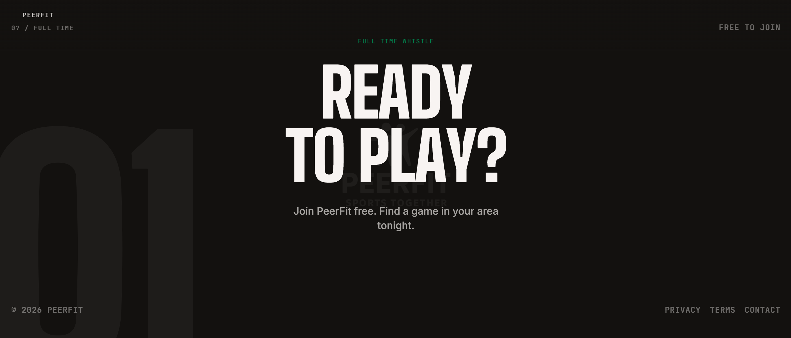

<h1 align="center">
  <a href="https://www.peerfit.co.uk/">
  
  </a>
  <br>
  PeerFit
</h1>

<p align="center">
  <b>Find people. Play sports. Stay active.</b><br>
  A social sports platform for discovering local players, joining activities,<br>
  and building real community through sport.
</p>

<p align="center">
  <a href="https://www.peerfit.co.uk"></a>
  <a href="https://github.com/OElhwry/Peerfitv2/releases/tag/v1.0.0"></a>
  
</p>

<p align="center">
  
  
  
  
  
  
</p>

<p align="center">
  <a href="#features">Features</a> ·
  <a href="#how-it-works">How it works</a> ·
  <a href="#tech-stack">Tech stack</a> ·
  <a href="#project-structure">Project structure</a> ·
  <a href="#getting-started">Getting started</a> ·
  <a href="#scripts">Scripts</a>
</p>

---

## Features

**Landing** — Seven-beat scroll-snapping editorial snap deck with sport imagery, animated intro stinger, live ticker, and community section.

**Auth** — Email authentication covering sign up, login, forgot password, reset password, and callback handling.

**Feed** — Activity feed with search and filters, likes, saves, comments, and live activity state indicators.

**Activities** — Create, edit, and delete activities with public or private visibility controls.

**Join requests** — Request flow for private activities with host approval and status tracking.

**Social** — Friends system with incoming requests, sent requests, and accepted connections.

**Calendar** — View upcoming sessions and joined events in a calendar layout.

**Profiles** — Player profiles with sport preferences, stats, achievements, reviews, and avatar uploads.

**Notifications** — Alerts for friend requests and join approvals.

**Settings** — Light and dark theme support with profile preferences.

## How It Works

1. Create an account and set up your profile with your preferred sports and skill level
2. Browse the feed to find activities near you
3. Join a public session instantly or send a request to a private one
4. Post your own activity and manage who joins
5. Build your network through shared sessions, friend requests, and reviews

## Tech Stack

* Next.js 15 with App Router
* React 18 and TypeScript
* Supabase for auth, database, and storage
* Tailwind CSS 4 with a hand-rolled editorial design system
* Radix UI for accessible primitives
* Lucide React for icons

## Project Structure

* `app/` — routes, pages, auth flows, and global styles
* `components/` — shared UI, navigation, and calendar components
* `lib/` — Supabase clients and utility helpers
* `public/` — static assets including sport images and the PeerFit logo

## Getting Started

```bash
npm install
npm run dev
```

Open [http://localhost:3000](http://localhost:3000) to view the app. A Supabase project with the matching schema is required for auth and data features.

## Scripts

```bash
npm run dev      # start the development server
npm run build    # create a production build
npm run start    # run the production build locally
npm run lint     # run ESLint
```

Deployed on [Vercel](https://vercel.com) at **[peerfit.co.uk](https://www.peerfit.co.uk)**. Every push to `main` triggers an automatic production deployment.
